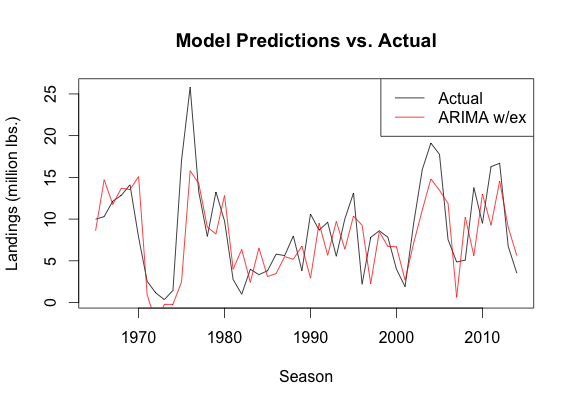
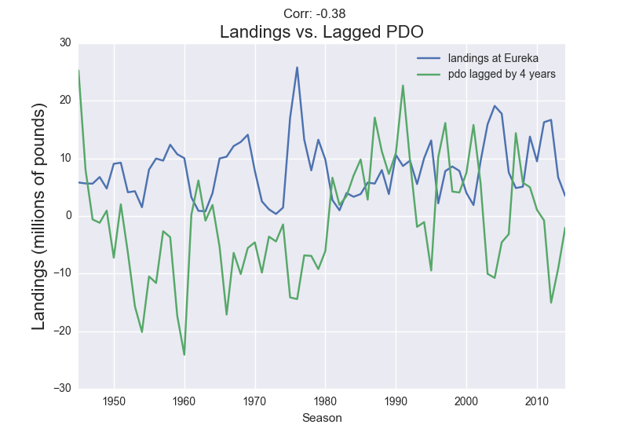
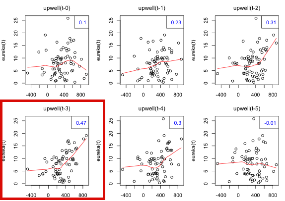
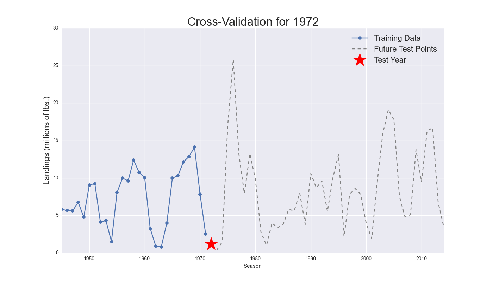
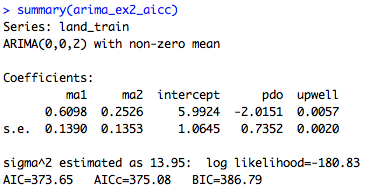

#OVERVIEW

The goal of my project was to predict the commercial catch of Dungeness Crab in the Northern California Eureka area. The Eureka area (defined by ports between Fort Bragg and the Oregon border) historically has contributed about 3/4 of all Dungeness for the state, but has also experienced dramatic and unpredictable seasonal fluctuations. 

To address this uncertainty, I created a predictive model that estimates landings in the Northern California region a year ahead of time. The best-performing model incorporates data of landings from previous seasons as well as relevant exogenous environmental factors sampled from 3-4 years prior to the target prediction year. These findings are reasonable considering that this variety of crab is known to become of commercially legal size at age 3-4.

My results were encouraging, as the best model shows not only increased predictive power over alternative models, but is also consistently robust across the testing window of the past 50 years. I gauged performance with out-of-sample simple mean absolute error, and summarize the results of testing of considered models below:

Comparing the model to a naive model such as the 'rolling mean' predictor was essential in justifying that a significant findings were found. The MAE of the residuals was decreased from 4.5 to 3.45, representing an overall reduction of uncertainty in forecasting.  Here is a comparison of out-of-sample model predictions overlaid the actual landings for those years for the best model.

###METHODS

My process started with initially coming up with a really dumb 'naive' model to serve as benchmark for a truly predictive model to beat. A "rolling mean" model predicts the average of all observations seen, and proves to be very stable and has an MAE of 4.5 Mlbs. {image}

Designing a model that could consistently outpredict a naive one was an exploration into time series analysis as well as the realm of marine biology and environmental sciences. I scraped websites with oceanographic measures which have been shown to influence marine wildlife and the abundance of fisheries on the Pacific coast. The most useful among these were the Pacific Decadal Osciallation and Upwelling Index at 42nd latitude (closest to the Eureka port area).

At real time, these measures don't have a clear relationship to the landings. However, when resampled on an annual frequency from the optimal month and lagged to the optimal amount of years, both factors had significant correlations to landings.  Pandas timeseries functionality was instrumental in making these transformations that enabled these findings. 

PDO: resample the cumulative year beginning in OCT 4 years prior

Upwell: resample the cumulative year beginning in APR 3 years prior

One can reason that these a negative PDO and a high upwelling index are highly favorable for Dungeness crab population success in the larval to early juvenile phases, thus resulting in higher landings in the season 3-4 years later.

## Modeling Techniques

With these potentially predictive factors, I modeled in R studio, largely using the forecast package. I pitted together traditionally successful time series models of the following flavors:

ARIMA, Exponential Smoothing, Linear Regression

###ARIMA
The best performing ARIMA model was developed using the auto.Arima function in R's forecast package. This function was most helpful because it automatically performs the Box-Jenkins method of fitting the best p,d,q parameters of the general ARIMA model to each of the 50 training sets. I enabled the auto.Arima function to integrate training data if it didn't initially pass the Augmented Dickey Fuller test for non-stationarity. That being said, differencing was not necessary on the vast majority of training sets (especially once training sets were > 20 years). All fits were chosen based on minimizing the corrected Akiake information criterion (AICc), a common recommendation for finite time series samples such as these. All training fits of the model also incorportated the exogenous regressors of PDO and upwelling (resampled & lagged optimally), a non-zero mean, and almost all had either 1 or 2 significant moving average terms with statistically significant coefficients.

For the sake of being thorough and to make sure I found the best variety of ARIMA model, I also trained and tested several variations of auto-fit and steady-state ARIMA MODELS (such as (p,d,q) = (1,0,0) and (0,0,1)) with and without exogenous regressors.

The other models were simpler to investigate, as they had far fewer options for fit.

###Exponential smoothing
 
ETS: I fit models with the ets function from R's forecast package.  I suppressed the gamma parameter to overlook any perceived seasonality. The exponential smoothing models were interesting to investigate as they consistently were fit with alpha parameters extremely close to 1 and near-zero beta parameters. This communicated to me that this variety of model wasn't returning anything really sophisticated: It was essentially predicting this year's landings for next year. That being said, it did not perform too badly in testing!

###Linear Regression

Multiple regressors with interecept: used both the aforementioned exogenous regressors, (PDO and upwelling lagged optimially,) plus a non-zero intercept. Model summaries showed highly significant negative coefficents for PDO, positive coefficients for upwelling, and a positive intercept.

Rolling Mean:
Intercept only: This is the baseline 'dumb' model which always predicts the cumulative mean of the observed landings in the training set.

##Model Evaluation

To see how models would have performed over the dataset, I used leave-one-out cross validation, training models from an constant origin of 1949 and testing each year from 1965 to 2014 (last season). This backtesting technique was selected because the objective was to find a model that captures the long term fluctuations of landings over several decades. (Experimenting with rolling origin training led to highly overfit models that had poor out-of-sample prediction accuracy.) 1949 served as the origin as it is the first year for which resampled upwelling index measurements were available.

Each of the 50 years in the test set was predicted with each model after they were fit to the window of training years preceding the test season. Because of the 3-4 year lag in exogenous regressors, their values were always able to be fed into the forecast function for at least the proceeding year.

I used mean absolute error as the metric for comparing out-of-sample prediction values because of its simplicity and interpretability in the context of this problem.

In addition to choosing a model that minimized out-of-sample error, it was also important to make sure that the model was consistent in its errors. I performed diagnostics on the model residuals, both in and out of sample, to confirm that they were normally distributed and did not show evidence of non-zero autocorrelation using the Box-Ljung test.

##Best Model

This is the model fit that we have predicting for the 2015 season, which is yet to open (it traditionally opens November, but had been delayed because of a public health risk related to a harmful algal bloom.)  That being said, it is predicting an uptick from last year's low-landing season in the Eureka area, and overall an above-average year with a point forecast of 9.38 Mlbs. The standard error on the forecast is 3.73 Mlbs.

##Conclusions

Variance in observed landings in the Eureka area can be partially explained by an auto-fit ARIMA model that incorporates exogenous regressors. The most exciting insights from the data exploration was being able to pinpoint the time windows in which the regressors had the most impact, and furthermore to confirm that they aligned with critical stages for survival in the life cycle of Dungeness crabs. From the modeling portion, it was most interesting to see that an ARIMA model fit with these regressors was a synergy of ARIMA and linear regression models, outperforming both of them in the evaluation phase.

#REPO GUIDE

##raw_data:
-Dcrab_Month&Port_2002-2015.xlsx
Excel file with landings organized by port and month from 2002-2014. This data was generously provided by the California Department of Fish and Wildlife, who have been tracking landings since 2002.

-erdCAMarCatSM_fb3f_4d76_6e3d.csv  
CSV file downloaded from the PFEL online, who has landings by port area from 1927-2002. 
http://coastwatch.pfeg.noaa.gov/erddap/tabledap/erdCAMarCatSM.csv?time,year,fish,port,landings&time%3E=1928-01-16&time%3C=2002-12-16T00:00:00Z&fish=%22Crab,%20Dungeness%22, http://coastwatch.pfeg.noaa.gov/erddap/tabledap/erdCAMarCatSM.html

##data_processing:
-merge_landings.py: 
reads all the landings data from the raw_data files and merges them into one pandas dataframe, period-indexed by month and year, for the identified port. It should be noted that when recording agencies changed, so did the conventions for identifying port areas

-consolidate_monthly.py
Consolidates all monthly data into the 4 generalized port areas that have been consistently labeled over the past century: Eureka, San Francisco, Monterey, Santa Barbara. The script also aggregates by season which is assigned as the year it opens (traditionally in November).

-scrape_pdo.py
Scrapes and pickles/writes to csv the PDO measurements provided by ______.
**this has one of the most instrumental scripts in "crosscorrelate_pdo" and "lag _samples" working in conjuntion

-scrape_upwell.py:
Scrapes and pickles/writes to csv the upwelling measurements at 42 and 39 parallel from _____.

## pickle data
## csv data

##data_exploration:

-eda_seasonal.py:
explores and visualizes trends in the landings data aggregated by season.

-pdo_exploration.py:
explores and visualizes cross correlation of PDO resamplings with the landings in Eureka. 

-pdo_exploration.R
explores and visualizes cross correlation of PDO resamplings with the landings in Eureka. 

-upwell_exploration.py:
explores and visualizes cross correlation of upwelling index (at 42nd latitude) resamplings with the landings in Eureka. 

-upwell_exploration.R
explores and visualizes cross correlation of upwelling resamplings (at 42nd latitude) with the landings in Eureka. 

##images

[many images from matplotlib, seaborn, and R plot outputs in the previous section]

##modeling

-all_models.R:
pits together 10 different varieties of time series models in an R script and compares resulting performance 

-best_model.R:
performs predictions for test set + 2015 season prediction

###REPRODUCE THE RESULTS:

To replicate the data collection and cleansing, run the scripts in data_processing in the order:
1. merge_landings
2. consolidate_monthly
3. scrape_pdo
4. scrape_upwell

However, this isn't necessary as all the munged data have been pickled and written to csv in the respective directories.

To explore the data transformations necessary to acquire the research-driven insight that drove the modeling, run (in order):

1. eda_seasonal
2. **pdo_exploration.py
3. pdo_exploration.R
4. upwell_exploration.py
5. upwell_exploration.R

Again, all the transformation are already written to csv for the modeling portion

To see model generation and selection:
1. all_models.R

It may be necessary to install the following packages:
astsa
forecast

To see the final model create a prediction for the upcoming season, run:
1. best_model.R

###THANK YOU!
Christy Juhasz, environmental scientist at the California Dept. of Fish and Wildlife
Tammy Lee, Director at Galvanize
Clayton Schupp, Director at Galvanize
Anna, Joel, Vikas, Sam, Nanfang: Students of Galvanize DSI's Cohort 10

###IN CASE YOU WERE WONDERING:

1. Landing data were subset from 1945 to present. Prior to WWII, crab pots weren't universally used, so seasonal landings were minimal in CA and largely unrepresentative of trends in the "crab pot era". 
2. The dungeness crab fishery is considered to be consistently ~90% exploited. For this reason, landings are also a great proxy for population assessment.
3. Dungeness crab have been regulated by size, sex, and season consistently for more than a century. Because of this, mating success is not considered to be affected by the high exploitation rate.
4. Non-commercial a.k.a. recreational fishing is believed to be ~1% of the total state landings and are untracked.
5. Dungeness crab health aren't affected by domoic acid, only the animals that eat them!